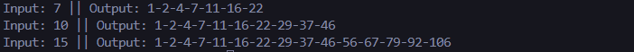
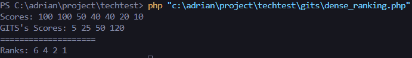
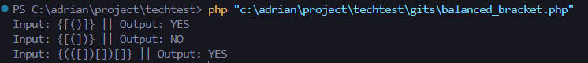

# Repository Algoritma PHP

Repository ini berisi tiga skrip PHP yang menyelesaikan berbagai masalah algoritmik. Setiap file difokuskan pada tugas tertentu dan menunjukkan pendekatan untuk tantangan algoritma yang umum.

## Deskripsi File

### 1. `generate_oeis.php`
Skrip ini menghasilkan deret bilangan berdasarkan rumus OEIS:

a(n) = n(n+1)/2 + 1 

referensi: [OEIS A000124](https://oeis.org/A000124)

#### Fitur:
- Menghasilkan deret bilangan untuk input `n` tertentu.
- Output berupa deret angka yang dipisahkan dengan tanda hubung.

#### Contoh Penggunaan:
```php
$test_cases = [7, 10, 15];
foreach ($test_cases as $test_case) {
    echo "Input: $test_case" . " || " . "Output: " . generateOEIS($test_case) . "\n";
}
```
ScreenShot Output:


### 2. `dense_ranking.php`
Skrip ini menghitung peringkat dense untuk daftar skor. Peringkat dense memberikan peringkat yang sama untuk skor yang sama.

#### Fitur:
- Menangani skor duplikat dengan benar untuk memberikan peringkat yang sama.
- Menghitung peringkat untuk skor baru berdasarkan daftar skor yang ada.

#### Contoh Penggunaan:
```php
$scores = [100, 100, 50, 40, 40, 20, 10];
$gitsScores = [5, 25, 50, 120];
$ranks = dense_ranking($scores, $gitsScores);

echo "Scores: " . implode(' ', $scores) . "\n";
echo "GITS's Scores: " . implode(' ', $gitsScores) . "\n";
echo "====================\n";
echo "Ranks: " . implode(' ', $ranks) . "\n";
```
ScreenShot Output:


### 3. `balanced_bracket.php`
Skrip ini memeriksa apakah sebuah string yang berisi tanda kurung seimbang. Sebuah string dianggap seimbang jika setiap tanda kurung buka memiliki tanda kurung tutup yang sesuai dan berada dalam urutan yang benar.

#### Fitur:
- Mendukung tanda kurung kurawal {}, siku [], dan bulat ().
- Mengembalikan YES jika string seimbang dan NO jika tidak.

#### Contoh Penggunaan:
```php
$test_cases = ['{[()]}', '{[(])}', '{{[[(())]]}}'];
foreach ($test_cases as $test_case) {
    echo "Input: $test_case || Output: " . isBalanced($test_case) . "\n";
}

// Output: YES NO YES
```
### ScreenShot Output:

